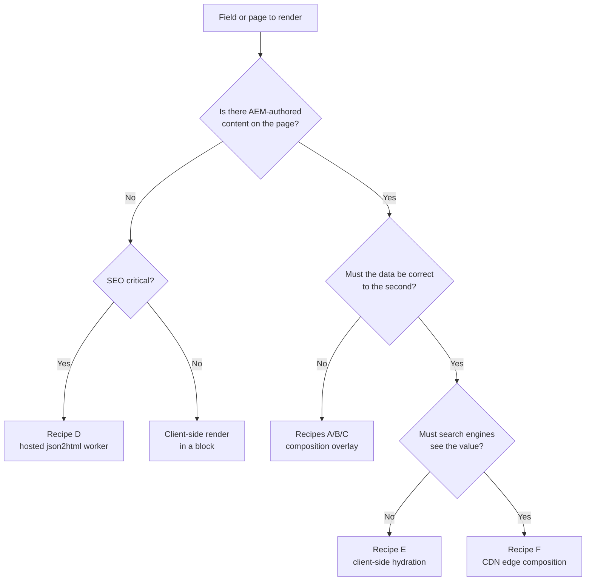

# Page Type Playbook: merging AEM content with external data

How to serve pages whose content comes primarily from AEM (authored in Universal Editor)
with parts supplied by an external API, rendered server-side.

Start with [ssr-overlay-architecture.md](ssr-overlay-architecture.md) for how the mechanism
works. This document is about applying it to each kind of page.

---

## 1. The one thing to understand first

**In Edge Delivery Services, "server-side rendering" happens at preview/publish time, not per
request.**

The Admin API fetches HTML from the overlay, ingests it into the content bus, and the CDN
serves that static HTML to every visitor. So composed data is a *snapshot* taken when the
page was published. It does not change until the page is published again.

This is excellent for SEO and performance — visitors get static HTML with no client-side
data fetching on the critical path — and wrong for anything that must be correct to the
second. Split your fields accordingly. That single decision drives every recipe below.

---

## 2. Decision tree



Rules of thumb:

- **Slow-changing and SEO-relevant** (specs, descriptions, images, ratings) -> compose it.
- **Fast-changing** (price, stock, promotions) -> hydrate it client-side. Never bake it in;
  a stale price is worse than a late one.
- **No authored content at all** -> you do not need this codebase's composer; use json2html.
- **Real-time and must be in the HTML** -> you need a CDN layer in front of `.aem.live`.
  This is a significant architectural commitment; do not reach for it by default.

---

## 3. How the composer is structured

Three moving parts, and adding a page type touches all three but nothing else:

| Part | Location | Role |
|------|----------|------|
| Route table | [ssr/src/routes.js](../ssr/src/routes.js) | which paths are composed, where the data comes from |
| Renderers | [scripts/renderers/](../scripts/renderers/) | turn API JSON into EDS block markup |
| Placeholder blocks | [blocks/](../blocks/) | authored markers, plus CSS and client-side hydration |

The renderers live under `scripts/` rather than inside `ssr/` on purpose: the browser imports
the very same modules for client-side hydration, so there is exactly one implementation of
each block's markup. `scripts/renderers/` is deliberately **not** in `.hlxignore`.

### The row contract

Renderers emit *pre-decoration* block content — a sequence of `<div>` rows, exactly what an
author would have produced. The block's `decorate()` then transforms those rows into final
DOM, just as it would for authored content. Consequences:

- Server-composed and client-hydrated pages converge on identical DOM.
- You write the decoration logic once.
- CSS never needs to care which path produced the content.

### Markup constraints

AEM strips `span` tags, `data-*` attributes and inline styles when ingesting BYOM markup, so
renderers must stay within plain semantic elements: `div` rows, `p`, `h2`-`h6`, `ul`/`li`,
`a`, `picture`/`img`, `strong`/`em`, `blockquote`. Use the helpers in
[scripts/renderers/html.js](../scripts/renderers/html.js), which escape values for you.

Because data attributes do not survive, the composer marks filled blocks with an extra
**class**, `api-rendered`. Block class names may only contain alphanumerics and single
dashes. `classList[0]` remains the block name, so extra classes are safe.

---

## 4. Adding a page type: the checklist

1. **Decide the row contract** — what rows the renderer emits and what `decorate()` makes of
   them. This is the contract between author, server and browser; changing it later breaks
   published pages.
2. **Create the block**: `blocks/<name>/_<name>.json` (model), `<name>.js`, `<name>.css`.
   Give the model an optional id override field.
3. **Write the renderer** in `scripts/renderers/<name>.js`, exporting a default function
   `(data) => htmlString`. Return `''` when the data cannot fill the block.
4. **Register it** in [scripts/renderers/index.js](../scripts/renderers/index.js).
5. **Add a route entry** in [ssr/src/routes.js](../ssr/src/routes.js).
6. **Hydrate client-side** in the block JS, guarded by the `api-rendered` class, so authors
   see content in Universal Editor.
7. **Test**: composition in `ssr/test/compose.test.js`, decoration in
   `ssr/test/blocks.test.js`. Both run under `npm run test:ssr`.
8. **Run it locally**: add a fixture to `drafts/`, then `npm run dev`.
9. **Regenerate models**: `npm run build:json`.
10. **Deploy and preview**: `npm run ssr:deploy`, then
    `npm run ssr:wire -- preview /your/path`.

---

## 5. Recipes

### Recipe A — Detail pages (PDP, event, store, profile)

The implemented case. One authored page per record; the record's key comes from the URL.

```js
{
  id: 'product-detail',
  match: '^/products/([\\w-]+)$',
  keyFrom: 'match:1',
  metaKey: 'product-id',
  endpoint: 'https://dummyjson.com/products/{{key}}',
  placeholders: {
    'product-specs': 'productSpecs',
    'product-gallery': 'productGallery',
    'product-reviews': 'productReviews',
  },
  seo: 'productSeo',
  cacheControl: 'public, max-age=300, s-maxage=300',
}
```

**Key resolution**, most specific first: an id typed into the block, then the page's
`product-id` metadata, then the URL match group. The URL alone is enough for the common case,
so authors normally configure nothing. The client resolves the key the same way, in
[scripts/product-data.js](../scripts/product-data.js), so both paths agree.

**Invalidation**: the source system's change webhook calls the `refresh` action with the
changed ids.

### Recipe B — Listing and category pages

An authored intro and hero, with an API-driven grid below.

Differences from Recipe A:

- Key off a category rather than a record: `metaKey: 'category-id'`, and a `match` that
  captures the category segment.
- The endpoint returns a collection. The renderer iterates it and emits one row per item —
  the same shape the `cards` block already expects, so you can often reuse its CSS.
- Paginate in the URL (`/category/shoes/2`) rather than a query string. Query strings are not
  separate content-bus resources, so they cannot be composed or cached as distinct pages.
- Listings change whenever *any* member changes, so lean more on the scheduled refresh in
  [.github/workflows/refresh-composed-pages.yaml](../.github/workflows/refresh-composed-pages.yaml)
  than on webhooks.

### Recipe C — Article and blog pages

The body is authored; sidebars are composed.

- The article body stays entirely authored — do not compose it.
- Placeholders for author bio and related articles, keyed off an `author-id` page meta.
- Two different data sources on one page means two route entries would each refetch. Prefer
  one endpoint returning both, or accept a second fetch and raise `FETCH_TIMEOUT_MS`.
- SEO: use `mode: 'fill'` for descriptions here, the opposite of a PDP. An editor's
  hand-written standfirst should beat a generated one.

### Recipe D — Pages with no authored content

No AEM page exists; the API is the whole source. Use the hosted json2html worker rather than
this composer: it renders a page from JSON via a Mustache template with no service to own.
See [JSON2HTML-SETUP.md](JSON2HTML-SETUP.md).

Only one overlay can be registered per site, so if you need both json2html and this composer,
the composer must handle both: give the route a `template` mode instead of a `placeholders`
map, and render the whole page when the primary source returns 404. Prefer avoiding that.

### Recipe E — Volatile fields (price, stock)

Deliberately **not** composed. `renderProductSpecs` omits price and stock, and there is a
test asserting they never appear in composed output.

Build these as a normal client-side block that fetches on decorate. Keep them out of the LCP
element, reserve their space in CSS to avoid layout shift, and render a sensible empty state
for when the API is down.

### Recipe F — Real-time values that must be in the HTML

Requires a CDN worker in front of `.aem.live` rewriting the response per request. Real costs:
latency on every request, a cache strategy to design, no local `aem up` fidelity, and a new
production dependency. Exhaust Recipes A and E first.

---

## 6. Failure behaviour

Every non-composed outcome returns **404**, which makes the Admin API fall back to the
primary AEM source. That makes the failure path byte-identical to having no overlay
configured — the safest available outcome, and the reason the overlay can be enabled for the
whole site without risk to existing pages.

| Situation | Outcome | Result |
|-----------|---------|--------|
| Path matches no route | `no-route` | Falls back. No network calls at all. |
| Page has no placeholder block | `no-placeholder` | Falls back. |
| Primary source 404s | `primary-missing` | Falls back. |
| No key could be resolved | `no-key` | Falls back. |
| API errored, timed out or returned nothing usable | `data-unavailable` | Falls back; client-side hydration fills the block. |
| Unexpected exception | `compose-error` | Falls back; logged as an error. |

Two properties worth preserving when you extend this:

- **Route matching happens before any network call.** The overlay is consulted for *every*
  path on the site, so a non-matching request must cost nothing.
- **Never emit a partially composed page.** Publishing half a page is worse than publishing
  the authored one.

---

## 7. Operating composed pages

### Refreshing

```bash
# Everything the composer owns, discovered from the query index
node ssr/scripts/refresh-composed.mjs --dry-run
node ssr/scripts/refresh-composed.mjs --batch 50

# Specific paths
npm run ssr:wire -- preview /products/1 /products/2
npm run ssr:wire -- publish /products/1 /products/2
```

The scheduled workflow derives its path list from the route table, so a new page type joins
the refresh cycle automatically.

**The bulk endpoints are asynchronous.** They answer `202` as soon as a job is queued, even
for a request that later fails authentication — a `202` says nothing about whether pages were
updated. [ssr/src/admin.js](../ssr/src/admin.js) therefore polls each job to completion and
only publishes when preview verifiably succeeded. Do not simplify that away.

### Diagnosing a page that is not composing

```bash
# Ask the composer directly; the body is the outcome code
curl -i "https://<namespace>.adobeioruntime.net/api/v1/web/edspdp-ssr/compose/products/1"

# Watch action logs
npm --prefix ssr run logs

# Reproduce locally against the same code the action runs
npm run dev
```

Most common causes, in order: the block class name in the page does not match the
`placeholders` key; the page was never previewed after the overlay was registered; the route
regexp does not match the real path; the primary source rejected the forwarded credential.

---

## 8. Open items

- **JSON-LD survival is unverified.** The composer emits
  `<script type="application/ld+json">` into `<head>`, but whether it survives ingestion has
  not been confirmed on a live preview. Verify with:

  ```bash
  npm run ssr:wire -- preview /products/1
  curl -s https://main--edspdp--rahul-chawla-akqa.aem.page/products/1 | grep ld+json
  ```

  If it is stripped, the fallback is to emit the fields as `<meta>` tags (which definitely
  survive) and assemble the JSON-LD in `scripts.js` during the delayed phase. Meta-tag SEO
  works either way, so only structured data is at risk.
- **PageSpeed Insights has not been run** against a composed page; it needs one published
  first. Composed pages add no client-side data fetching, so the expectation is parity with
  authored pages, but confirm it rather than assuming.
